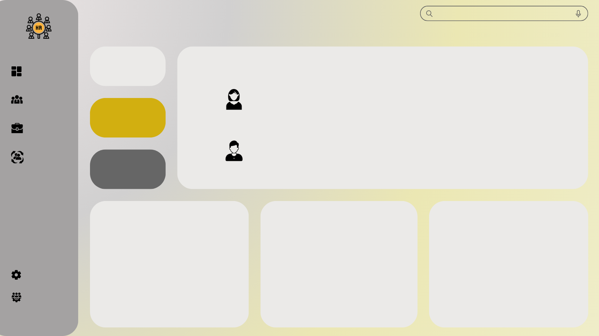

# HR Intelligence Platform — Employee Attrition Prediction & Workforce Analytics

A production-ready enterprise HR Analytics web application that transforms IBM HR workforce data into actionable insights. Combines data cleaning, EDA, machine learning, REST APIs, and an interactive golden-themed dashboard.



**Live Demo:** Frontend on Vercel | Backend on Render (configure after deployment)

**Repository:** [github.com/Tanushree2004-byte/HR_Analytics](https://github.com/Tanushree2004-byte/HR_Analytics)

---

## Project Overview

Organizations lose talent and institutional knowledge when employees leave unexpectedly. This platform analyzes HR workforce data to identify attrition patterns, build predictive models, and deliver an interactive dashboard for HR teams.

**Complete workflow:**
1. Data ingestion & professional cleaning
2. Exploratory data analysis with 23+ visualizations
3. Multi-model ML training & comparison
4. Flask REST API layer
5. Enterprise dashboard UI with prediction & reports

---

## Features

| Module | Status | Highlights |
|--------|--------|------------|
| Data Cleaning | ✅ Complete | Missing values, outliers, encoding, scaling, feature engineering |
| EDA & Reports | ✅ Complete | 23 charts, business insights, correlation & heatmap analysis |
| ML Models | ✅ Complete | Logistic Regression, Decision Tree, Random Forest, Gradient Boosting |
| Prediction API | ✅ Complete | Real-time attrition risk with recommendations |
| HR Dashboard | ✅ Complete | KPIs, 15+ charts, employee table, filters |
| Prediction Page | ✅ Complete | HR form, risk gauge, confidence meter |
| Reports Module | ✅ Complete | PDF, CSV, Excel export + CSV upload + model retraining |
| Deployment | ✅ Ready | Vercel (frontend) + Render (backend) configs |

**Additional:** Dark mode, animated counters, toast notifications, responsive design, collapsible sidebar, 404 page

---

## Technologies Used

| Layer | Stack |
|-------|-------|
| Frontend | HTML5, CSS3, JavaScript (ES6), Chart.js |
| Backend | Flask, Flask-CORS, Gunicorn |
| ML | Python, Pandas, NumPy, Scikit-learn, Joblib |
| Visualization | Matplotlib, Seaborn, Chart.js |
| Reports | ReportLab (PDF), OpenPyXL (Excel) |
| Deployment | Vercel, Render |
| Version Control | Git, GitHub |

---

## Dataset Information

**Source:** IBM HR Analytics Employee Attrition & Performance

**File:** `data/HR-Employee-Attrition.csv`

| Property | Value |
|----------|-------|
| Records | 1,470 employees |
| Features | 35 columns |
| Target | `Attrition` (Yes / No) |
| Attrition Rate | ~16% |

---

## Machine Learning Workflow

```
Raw CSV → Cleaning → Feature Engineering → Train/Test Split (80/20)
    → Model Training (4 algorithms) → Evaluation → Best Model Selection
    → Joblib Serialization → Flask API → Dashboard
```

**Models trained:** Logistic Regression, Decision Tree, Random Forest, Gradient Boosting

**Best model:** Logistic Regression (selected by ROC-AUC)

**Metrics tracked:** Accuracy, Precision, Recall, F1-Score, ROC-AUC, Confusion Matrix, ROC Curves

---

## Folder Structure

```
HR_Analytics/
├── data/                          # Raw & processed datasets
├── frontend/                      # Dashboard UI (HTML, CSS, JS)
│   ├── css/                       # Styles + dark mode
│   └── js/                        # API client, charts, page logic
├── src/
│   ├── backend/                   # Flask REST API
│   │   ├── app.py
│   │   └── services/              # Data & report services
│   ├── data_processing/           # Cleaning & EDA pipelines
│   └── ml/                        # Training & prediction
├── models/                        # Trained model artifacts
├── reports/                       # Cleaning reports, EDA charts, insights
├── tests/                         # API smoke tests
├── deployment/                    # Deployment configs
├── run_pipeline.py                # Run cleaning → EDA → training
├── render.yaml                    # Render deployment
├── vercel.json                    # Vercel deployment
├── Procfile                       # Gunicorn process file
└── requirements.txt
```

---

## Installation Steps

### Prerequisites
- Python 3.10+
- Git

### Clone & Setup

```bash
git clone https://github.com/Tanushree2004-byte/HR_Analytics.git
cd HR_Analytics

python -m venv venv
venv\Scripts\activate        # Windows
# source venv/bin/activate     # macOS/Linux

pip install -r requirements.txt
```

### Run Data Pipeline

```bash
python run_pipeline.py
```

This executes: data cleaning → EDA chart generation → ML model training.

---

## Running the Project Locally

### Start Backend (serves API + frontend)

```bash
set PYTHONPATH=.          # Windows
# export PYTHONPATH=.     # macOS/Linux
python src/backend/app.py
```

Open **http://localhost:5000** in your browser.

### Run Tests

```bash
python tests/test_api.py
```

---

## Deployment Instructions

### Backend → Render

1. Connect GitHub repo to [Render](https://render.com)
2. Use `render.yaml` blueprint or manual setup:
   - **Build:** `pip install -r requirements.txt && python run_pipeline.py`
   - **Start:** `gunicorn src.backend.app:app --bind 0.0.0.0:$PORT`
3. Set env vars: `CORS_ORIGINS=https://your-vercel-app.vercel.app`

### Frontend → Vercel

1. Import repo to [Vercel](https://vercel.com)
2. Root directory: project root (uses `vercel.json`)
3. Update API proxy URL in `vercel.json` to your Render backend URL
4. Or set `hr-api-url` in Settings page after deployment

---

## API Endpoints

| Method | Endpoint | Description |
|--------|----------|-------------|
| `GET` | `/api/health` | Health check |
| `GET` | `/api/dashboard` | KPIs, charts, departments, jobs |
| `POST` | `/api/predict` | Predict employee attrition |
| `GET` | `/api/employees` | Paginated employee list (search, filter, sort) |
| `GET` | `/api/model-metrics` | ML model comparison metrics |
| `GET` | `/api/insights` | EDA business insights |
| `GET` | `/api/departments` | Department analytics |
| `GET` | `/api/jobs` | Job role analytics |
| `POST` | `/api/upload` | Upload new CSV dataset |
| `POST` | `/api/retrain` | Retrain ML model |
| `GET` | `/api/download-report?format=pdf\|csv\|excel` | Export reports |

---

## Dashboard Pages

| Page | URL | Description |
|------|-----|---------------|
| Dashboard | `/` | KPIs, charts, insights, employee preview |
| Employees | `/employees.html` | Searchable, sortable, paginated table |
| Departments | `/departments.html` | Department-level analytics |
| Jobs | `/jobs.html` | Job role analytics |
| Analytics | `/analytics.html` | Deep analytics + all insights |
| Prediction | `/prediction.html` | ML attrition prediction form |
| Reports | `/reports.html` | PDF/CSV/Excel export, upload, retrain |
| Settings | `/settings.html` | Theme, API config |
| Support | `/support.html` | Help documentation |

---

## Future Enhancements

- [ ] SHAP/LIME model explainability
- [ ] Real-time HRIS integration
- [ ] User authentication & RBAC
- [ ] Email alerts for high-risk employees
- [ ] Power BI embedded dashboards
- [ ] Docker containerization

---

## License

MIT License — see [LICENSE](LICENSE)

---

## Author

**Tanushree**

- GitHub: [@Tanushree2004-byte](https://github.com/Tanushree2004-byte)
- Project: [HR_Analytics](https://github.com/Tanushree2004-byte/HR_Analytics)

---

*Built as a production-quality Data Analytics portfolio project for Data Analyst and Business Intelligence roles.*
